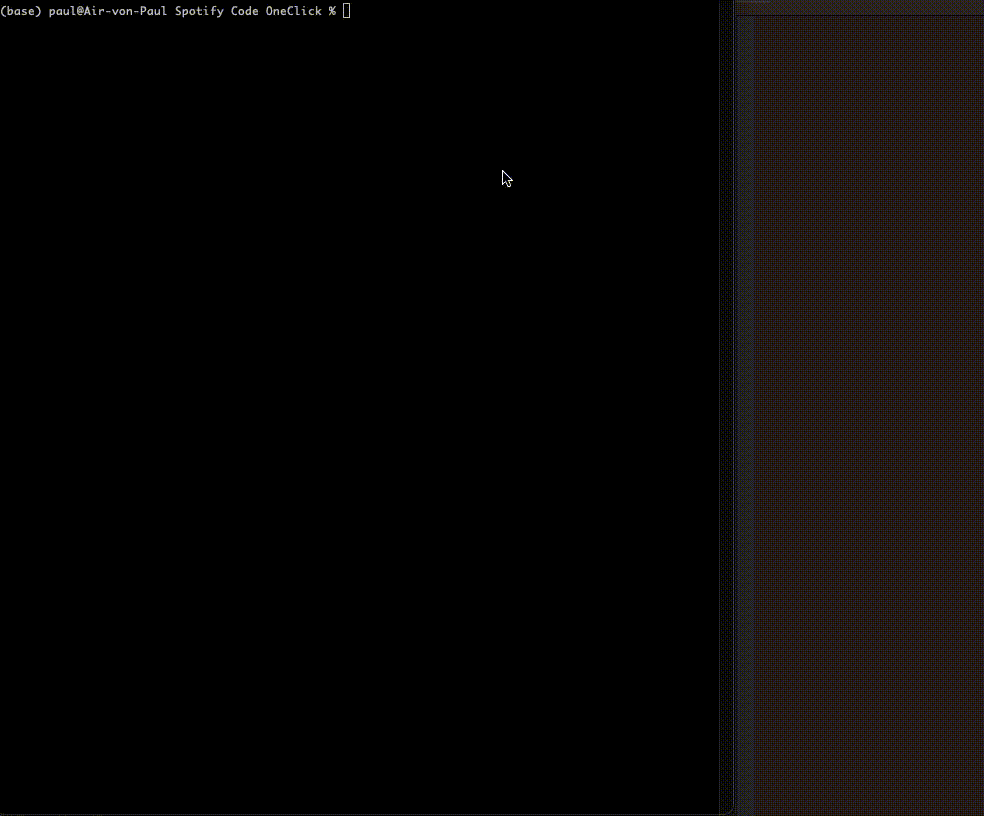

# Create Spotify Codes less complicated.
## Why? 
When searching for a song in Spotify (Website or App) one is not able to directly copy the Spotify Code from there. 
One needs to copy the link of the track, go to another website from spotiy, paste there the code and then download it. This is really not a problem at all, except one very specific usecase: 
If you want a huge number of potential non-technical people to create these codes. Then you want a more straigt-foward approach. 
To be clear: I started this project to be able to create a musical guestbook. Each guest can select a song, print the code and stick it into a guestbook. 

## Current Status of the Project: Work in Progress
Right now the application is a work in progress. It works as terminal interaction, not very useful for the non-technical target group of users :) That's why there are some more Todos.
- [ ] Error Handling: create error messages for user
- [ ] Create HTTP interface (potentialy clone the spotify interface)
- [ ] create docker to be able run the code anywhere
- [ ] English translation of instructions in terminal (instead of German)
- [ ] include the use of a mini printer to instantly print the code

## How? 

I use the Spotify API to use their search function and get the correct URI. Then instead of using a browser automation tool, I discovered, that the download links follow a quite simple pattern. Also they are always active.
So I use the URI to create the correct download link. 
To use this you need an Spotify API Token, which you can copy in the file [secrets_template.json](secrets_template.json) and delete the _template suffix. Dont publish your token on GitHub!
Then just run [terminal_interaction.py](terminal_interaction.py) in the terminal. 
